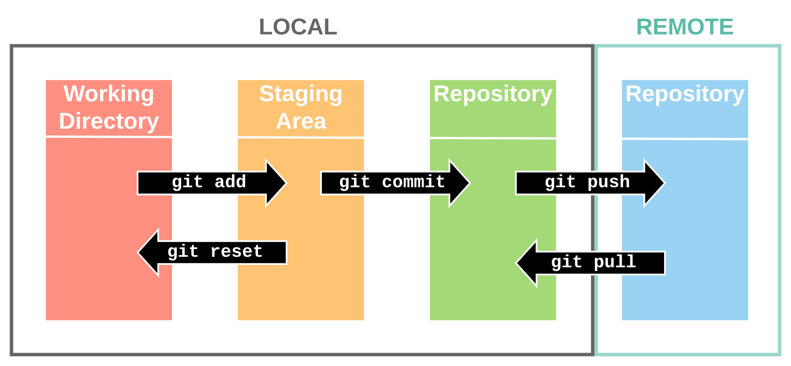
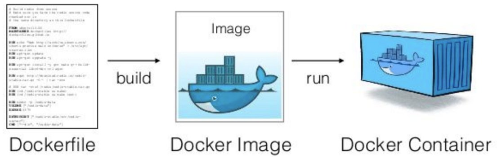

# How To Dev
## Workshop

---

## Core Idea

---

## Core Idea
 Software is messy, especially when distributed.

---

## Greatest compliment

---

## Greatest compliment
 It just works!

---

## What brakes programs?

---

## What brakes programs?
 Code

---

## What brakes programs?
 Code
 Environment

---

## Development enablers

---

## Development enablers
 Code

---

## Development enablers
 Code - Version control system

---

## Development enablers
 Code - Version control system - **Git**

---

## Development enablers
 Code - Version control system - **Git**
 Environment

---

## Development enablers
 Code - Version control system - **Git**
 Environment - Containerized environment

---

## Development enablers
 Code - Version control system - **Git**
 Environment - Containerized environment - **Docker**

---

## Development enablers
 **Git**
 **Docker**

---

## Development enablers
 **Linux**
 **Git**
 **Docker**

---

## Linux


---

## Linux
 Most computations runs on **servers**

---

## Linux
 Most computations runs on **servers**
 Most **servers** runs **Linux** 

---

## Linux
 Most computations runs on **servers**
 Most **servers** runs **Linux** 
 Most effective in resources

---

## Linux
 Most computations runs on **servers**
 Most **servers** runs **Linux** 
 Most effective in resources
 **Linux** philosophy

---

## Linux
### Linux Philosophy

---

## Linux
### Linux Philosophy
 Do only one thing

---

## Linux
### Linux Philosophy
 Do only one thing
 And do it well

---

## Linux
### Linux Philosophy
#### In practice

---

## Linux
### Linux Philosophy
#### In practice
 Built out of tiny independent programs

---

## Linux
### Linux Philosophy
#### In practice
 Built out of tiny independent programs
 Productive terminal environment

---

## Linux
 Fill at **~** in the **$**

---

## Linux
 Fill at **~** in the **$**
 Fill at **home** in the **terminal** (shell)

---

## Linux
 This is the **/** of the problem

---

## Linux
 This is the **/** of the problem
 This is the **root** of the problem

---

## Linux
 What is going on **.** ?

---

## Linux
 What is going on **.** ?
 What is going on **here** ?

---

## Linux
 My **~** is at **/home/user/**

---

## Linux
 Where have you **bin/** ?

---

## Linux
 Where have you **bin/** ?
 Directory structure:
**/bin /home /opt /tmp /usr /var /etc** 

---

## Linux
 Don't **Bash** your head against the keyboard

---

## Linux
 You don't need to say goodbye to your Windows machine **WSL** to the rescue

---

## Linux
### Hands-on!

---

## Linux
### Hands-on keyboard!

---

## Linux
### Hands-on keyboard!
 Go to cmd

---

## Linux
### Hands-on keyboard!
 Go to cmd
```ssh -i how-to-dev_key.pem howtodev@172.160.226.208```

---

## Linux
### Utilities

---

## Linux
### Utilities
```bash
ls
```
List all files in a directory

---

## Linux
### Utilities
```bash
cd
```
Change directory

---

## Linux
### Utilities
```bash
cat
less
```
Show content of file

---

## Linux
### Utilities
```bash
touch
cp
mv
```
Make, copy, move or rename files

---

## Linux
### Utilities
```bash
mkdir
```
Make a directory

---

## Git

---

## Git


---

## Git
```bash
mkdir <dir_name>
```

---

## Git
```bash
mkdir <dir_name>
git init .
```

---

## Git
```bash
mkdir <dir_name>
git init .
git status
```

---

## Git
```bash
nano <file_name>
echo <content> > <file_name>
```
Enter some content to a file.

---

## Git
```bash
nano <file_name>
echo <content> > <file_name>
git status
```

---

## Git
```bash
nano <file_name>
echo <content> > <file_name>
git status
git add <file_name>
```

---

## Git
```bash
nano <file_name>
echo <content> > <file_name>
git status
git add <file_name>
git status
```

---

## Git
```bash
nano <file_name>
echo <content> > <file_name>
git status
git add <file_name>
git status
git commit -m "some commit message"
```

---

## Docker


---

## Docker


---

## Docker
```bash
docker build --tag "how-to-dev" .
```
Building a new docker image based on the 'Dockerfile' in the current directory.

---

## Docker
```bash
docker image list
```
```
REPOSITORY   TAG       IMAGE ID       CREATED              SIZE
how-to-dev   latest    d211d6bfa5ab   About a minute ago   202MB
```

---

## Docker
```bash
docker run --interactive --tty --name <my_name> how-to-dev bash
```

---

## Docker
```bash
docker run -it --name <my_name> how-to-dev bash
```

---

## Docker
```bash
docker container list
docker container list --all
```

---

## Docker
```bash
docker run \
    -tty \
    --detach \
    --name <my_name> \
    how-to-dev \
    bash
```

---

## Docker
```bash
docker container list
docker container list --all
```

---

## Docker
```bash
docker exec -t <my_name> bash -c "ls"
```

---

# Bye

**Ben Sivan**
Data Scientist

+972-546925522
ben.sivan@celleste-bio.com
